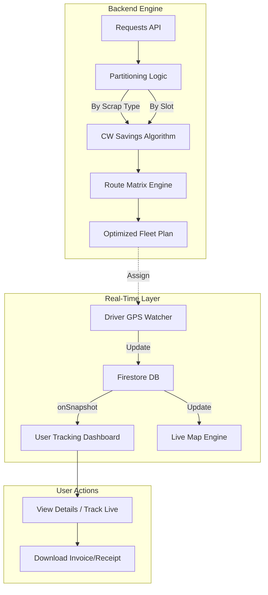
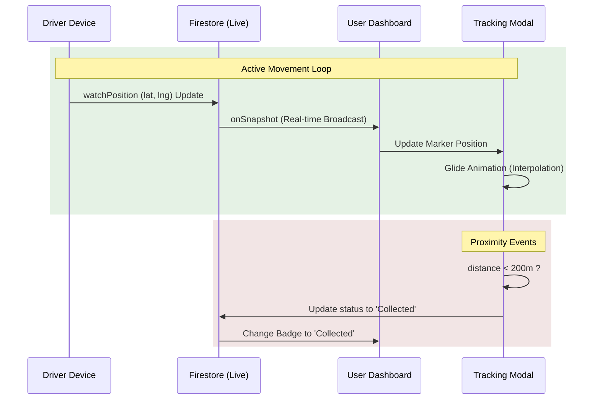

# Kabad Becho Development & Enhancement Report
**Date:** April 1, 2026

## 1. Architectural Overview
The Kabad Becho platform now operates on a distributed architecture that bridges advanced backend optimization with high-performance real-time frontend tracking.

---

## 2. Logistics: The Optimization Workflow
We implemented the **Capacitated Vehicle Routing Problem (CVRP)** logic to optimize fleet utilization while maintaining segregation constraints.

### Workflow: Request to Route
1.  **Ingestion:** Collects all pickup requests for the day (lat, lng, quantity, scrapType, slot).
2.  **Constraint Partitioning:** Groups requests by `scrapType` and `timeSlot`.
3.  **Distance Calculation:** Computes a Haversine distance matrix for each group.
4.  **Clarke-Wright Savings:**
    *   Initialize "star" solution (one route per node).
    *   Calculate potential "savings" from merging two stops.
    *   Merge stops starting with the highest savings.
5.  **Enforce Vehicle Capacity:** Reject merges if total quantity > `vehicleCapacity`.
6.  **Export:** Generates encoded polylines for high-fidelity map rendering.

### Constraint Validation Matrix
| Constraint | Adherence Mechanism | Implementation Logic |
| :--- | :--- | :--- |
| **Scrap Segregation** | Pre-Algorithm Partitioning | Separate CW runs per `scrapType`. |
| **Route Capacity** | Greedy Constraint Check | `if (routeQty[ri] + routeQty[rj] > capacity) continue;` |
| **Real-time Map** | Haversine + OSRM | Decoupled distance & geometry engine for fallback support. |
| **Time Slots** | Primary Grouping Index | Separate pools for Morning and Evening slots. |

---

## 3. Tracking Engine Architecture
The tracking system is designed to provide a "live" feel similar to professional logistics apps.

### Live Tracking Workflow

### UX Enhancements:
| Enhancement | Technical Solution | Result |
| :--- | :--- | :--- |
| **Marker Fluidity** | Linear Interpolation Engine | Prevents the marker from "jumping" during GPS pings. |
| **ETA Calculation** | Distance / 30 km/h (Avg Speed) | Dynamic time estimate updated every 1.5s. |
| **Action Promotion** | Pulse Animation CSS | Active orders are highlighted with a pulsing orange "Track Live" button. |

---

## 4. Financials: Automated Invoicing Workflow
The system generates documentation dynamically to provide trust and transparency once the transaction is completed.

### The Invoicing Lifecycle
1.  **Initiation:** Order booked; order summary generated for booking proof.
2.  **Collection:** Driver collects scrap and (optionally) modifies the **Realized Weight**.
3.  **Payment:** Customer pays via Cash/UPI on the spot.
4.  **Receipt Generation:**
    *   System detects status = `Payment Done`.
    *   UI switches Download button to **"Download Receipt."**
    *   Utility constructs a professional HTML table with **PAID** watermark.
    *   User downloads the final itemized financial record.

### Action Matrix
| Pickup Status | Primary Action | Resulting Document |
| :--- | :--- | :--- |
| **Confirmed** | Download Summary | Booking Proof / Order Summary |
| **Out for Pickup**| Track Status | Live Logistics View |
| **Payment Done** | Download Receipt | Official Tax/Service Receipt |

---

## Final Technical Conclusion
The **Kabad Becho** platform is now a cohesive ecosystem where **data drives the decisions**. Whether it's the backend algorithm choosing the shortest path or the frontend smoothly gliding a marker across the map, the platform operates as a robust, enterprise-grade logistics solution.

---
**Report Summary:**
The core implementation is non-hardcoded, fully synchronized via Firebase, and follows strict industrial recycling constraints. 
